# Glass Box Hesaplama Haritası (Computational Map)

Bu harita, 1. ve 2. haftalık araştırmanın metodolojik akışını birlikte gösterir. İlk beş aşamaya ek olarak Week 2'de çoklu seed tekrarı, random-control karşılaştırması, istatistiksel ayrışma ve Transformer/LLM ölçekleme katmanları eklenmiştir.

```mermaid
flowchart LR

subgraph ROW1["① MODELİ AÇ — GÖZLEM (OBSERVE)"]
direction LR
INPUT["<b>GİRDİ (INPUT)</b><br/>Girdi"]
MODEL["<b>AI MODELİ</b><br/>Black Box (Kara Kutu)<br/><br/>❓ İçeride ne oluyor?"]
OUTPUT["<b>ÇIKTI (OUTPUT)</b><br/>Çıktı"]
IR["<b>İÇ TEMSİL (INTERNAL REPRESENTATION)</b><br/>İç Temsil<br/><br/>❓ Model bilgiyi içeride nasıl temsil ediyor?"]
OBS["<b>GÖZLEM (OBSERVATION)</b><br/>Gözlem<br/><br/>❓ Hangi iç bileşen<br/>hangi girdiye tepki veriyor?"]
INPUT --> MODEL --> OUTPUT
MODEL --> IR --> OBS
end

subgraph ROW2["② İÇ TEMSİLİ İNCELE — ÖZELLİK ANALİZİ (FEATURE ANALYSIS)"]
direction LR
subgraph IRSTRUCT["İÇ TEMSİL — YAPI (INTERNAL REPRESENTATION)"]
direction LR
LAYER["<b>KATMAN (LAYER)</b><br/>Katman"]
NEURON["<b>NÖRON / BOYUT (UNIT / DIMENSION)</b><br/>Nöron veya Transformer boyutu"]
ACT["<b>AKTİVASYON (ACTIVATION)</b><br/>Aktivasyon"]
REPR["<b>TEMSİL ÖĞRENME (REPRESENTATION LEARNING)</b><br/>İç temsil"]
end
subgraph FEATURES["ÖZELLİK ANALİZİ — ÖZELLİKLERİ BUL (FEATURE ANALYSIS)"]
direction LR
FV["<b>ÖZELLİK GÖRSELLEŞTİRME</b><br/>Feature visualization"]
FA["<b>ÖZELLİK ANALİZİ</b><br/>Feature analysis"]
SAE["<b>SAE / DICTIONARY LEARNING</b><br/>İleri özellik ayrıştırma"]
end
CF["<b>ADAY ÖZELLİK / ADAY BOYUT</b><br/>Candidate feature / dimension"]
OBS --> IRSTRUCT
IRSTRUCT --> FEATURES
FEATURES --> CF
end

subgraph ROW3["③ TEST ET — HİPOTEZ / MÜDAHALE (HYPOTHESIS / INTERVENTION)"]
direction LR
HYP["<b>HİPOTEZ</b><br/>Gözlenen ilişki davranışı açıklıyor olabilir mi?"]
INT["<b>MÜDAHALE</b><br/>Kontrollü olarak değiştirme"]
subgraph METHODS["MÜDAHALE YÖNTEMLERİ"]
direction LR
ABL["<b>ABLASYON</b><br/>Bileşeni kapatma"]
PATCH["<b>AKTİVASYON YAMALAMA</b><br/>Başka çalıştırmadan aktivasyon taşıma"]
STEER["<b>AKTİVASYON YÖNLENDİRME</b><br/>Aktivasyonu kontrollü değiştirme"]
ATTR["<b>KATKI / GRUP MÜDAHALESİ</b><br/>Bileşen veya grup etkisi"]
end
CF --> HYP --> INT --> METHODS
end

subgraph ROW4["④ ETKİYİ ÖL — NEDENSEL KANIT (CAUSAL EVIDENCE)"]
direction LR
CHANGE["<b>ÇIKTI DEĞİŞİMİ</b><br/>Müdahale sonrası değişim"]
REPEAT["<b>TEKRARLI TESTLER</b><br/>Aynı etki farklı örneklerde / seed'lerde görülüyor mu?"]
CAUSAL["<b>NEDENSEL KANIT</b><br/>Müdahale ile davranış değişimi arasındaki destek"]
METHODS --> CHANGE --> REPEAT --> CAUSAL
end

subgraph ROW5["⑤ KONTROL ET — İSTATİSTİKSEL DOĞRULAMA (STATISTICAL VALIDATION)"]
direction LR
RANDOM["<b>RANDOM CONTROLS</b><br/>Aynı deney tasarımında rastgele bileşenler"]
MULTI["<b>MULTI-SEED REPLICATION</b><br/>Farklı seed'lerde tekrar"]
STATS["<b>İSTATİSTİKSEL AYRIŞMA</b><br/>z-score / percentile / dağılım karşılaştırması"]
HOLDOUT["<b>DISCOVERY → HOLDOUT</b><br/>Adayın bağımsız örnekte kontrolü"]
CAUSAL --> RANDOM
CAUSAL --> MULTI
RANDOM --> STATS
MULTI --> STATS
STATS --> HOLDOUT
end

subgraph ROW6["⑥ MEKANİZMASI ÇIKAR — DOĞRULA (MECHANISTIC VALIDATION)"]
direction LR
CIRCUIT["<b>DEVRE KEŞFİ (CIRCUIT DISCOVERY)</b><br/>Etki hangi hesaplama yolundan geçiyor?"]
CMAP["<b>DEVRE HARİTASI</b><br/>Aktivasyon → İç temsil → Müdahale → Çıktı"]
MHYP["<b>MEKANİZMA HİPOTEZİ</b><br/>Aday mekanizmanın açıklaması"]
VALID["<b>MEKANİSTİK DOĞRULAMA</b><br/>Mekanizma davranışı açıklıyor mu?"]
FINAL["<b>MEKANİSTİK YORUMLANABİLİRLİK</b><br/>Model davranışının iç hesaplama açıklaması"]
HOLDOUT --> CIRCUIT --> CMAP --> MHYP --> VALID --> FINAL
end

subgraph ROW7["⑦ ÖLÇEĞİ GENİŞLET — TRANSFORMER / LOCAL LLM (WEEK 2)"]
direction LR
TRANS["<b>TRANSFORMER İÇ TEMSİLİ</b><br/>distilgpt2 / hidden dimensions"]
GROUP["<b>GRUP MÜDAHALESİ</b><br/>Non-additive effect"]
SYNTH["<b>SENTETİK TRUE-vs-SPURIOUS</b><br/>Kontrollü mekanizma testi"]
LOCAL["<b>LOCAL LLM</b><br/>Llama 3.2 1B / Ollama"]
CAUTION["<b>METODOLOJİK SINIR</b><br/>Davranışsal çıktı tek başına mekanistik kanıt değildir"]
TRANS --> GROUP --> SYNTH --> LOCAL --> CAUTION
end

classDef system fill:#dbeafe,stroke:#2563eb,stroke-width:3px,color:#111827;
classDef blackbox fill:#e5e7eb,stroke:#374151,stroke-width:3px,color:#111827;
classDef observe fill:#cffafe,stroke:#0891b2,stroke-width:3px,color:#111827;
classDef structure fill:#f3f4f6,stroke:#6b7280,stroke-width:2px,color:#111827;
classDef feature fill:#fef3c7,stroke:#d97706,stroke-width:3px,color:#111827;
classDef intervention fill:#fed7aa,stroke:#ea580c,stroke-width:3px,color:#111827;
classDef causal fill:#dcfce7,stroke:#16a34a,stroke-width:3px,color:#111827;
classDef stats fill:#e0f2fe,stroke:#0284c7,stroke-width:3px,color:#111827;
classDef circuit fill:#e9d5ff,stroke:#9333ea,stroke-width:3px,color:#111827;
classDef validation fill:#bbf7d0,stroke:#15803d,stroke-width:4px,color:#111827;
classDef advanced fill:#e0e7ff,stroke:#4f46e5,stroke-width:2px,color:#111827;
class INPUT,OUTPUT system;
class MODEL blackbox;
class IR,OBS observe;
class LAYER,NEURON,ACT,REPR structure;
class FV,FA,SAE,CF feature;
class HYP,INT,ABL,PATCH,STEER,ATTR intervention;
class CHANGE,REPEAT,CAUSAL causal;
class RANDOM,MULTI,STATS,HOLDOUT stats;
class CIRCUIT,CMAP,MHYP circuit;
class VALID validation;
class FINAL validation;
class TRANS,GROUP,SYNTH,LOCAL,CAUTION advanced;
```

## Ana Zincir

`VERİ (DATA) → MODEL → İÇ TEMSİL (INTERNAL REPRESENTATION) → ÖZELLİK / BOYUT (FEATURE / DIMENSION) → MÜDAHALE (INTERVENTION) → ÇIKTI DEĞİŞİMİ → TEKRAR / KONTROL → İSTATİSTİKSEL DOĞRULAMA → DEVRE → MEKANİSTİK DOĞRULAMA`

## Week 2'nin metodolojik ekleri

- **Multi-seed replication:** Tek bir seed'e bağlı kalmadan aday devre etkisinin tekrarını ölçer.
- **Random controls:** Aday bileşenin etkisini aynı deney tasarımındaki rastgele kontrollerle karşılaştırır.
- **Statistical validation:** E09'da `z-score` ve empirical percentile gibi ölçülerle adayın kontrol dağılımındaki konumunu raporlar.
- **Discovery → Holdout:** E07'de aday iç temsil ayrışmasının bağımsız örneklerde sürüp sürmediğini kontrol eder.
- **Transformer / local LLM extension:** E07–E12 ile yöntemlerin daha büyük ve farklı model bağlamlarına taşınabilirliğini sınar.
- **Negative-result discipline:** E09 gibi başarısız kriterler de sonuç olarak korunur; başarısız testler mekanizmanın yokluğu değil, o deney tasarımında yeterli ayrışma bulunmadığı şeklinde yorumlanır.

Bu diyagram metodoloji haritasıdır; deney sonuçlarının yerine geçmez.
