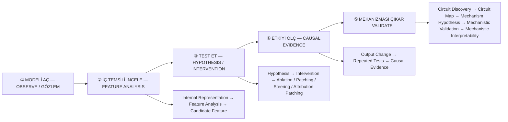

# Glass Box Computational Map

Bu harita 1. haftalık araştırma ödevindeki ana metodolojik akışı gösterir.

## Core chain
`DATA → MODEL → INTERNAL REPRESENTATION → FEATURE → INTERVENTION → OUTPUT → VALIDATION`

Bu diyagram metodoloji haritasıdır; deney sonuçlarının yerine geçmez.
