# Glass Box Computational Map

Bu harita 1. haftalık araştırma ödevindeki ana metodolojik akışı gösterir. Harita, araştırmanın 5 ana aşamasını ve her aşamadaki temel Glass Box AI kavramlarını birlikte gösterir.

```mermaid
flowchart LR

%% =========================================================
%% GLASS BOX AI — HORIZONTAL A4 POSTER
%% =========================================================

%% =========================================================
%% ROW 1 — SYSTEM + OBSERVE
%% =========================================================
subgraph ROW1["① MODELİ AÇ — OBSERVE / GÖZLEM"]
direction LR

INPUT["<b>INPUT</b><br/>Girdi"]
MODEL["<b>AI MODEL</b><br/>Black Box<br/><br/>❓ İçeride ne oluyor?"]
OUTPUT["<b>OUTPUT</b><br/>Çıktı"]
IR["<b>INTERNAL REPRESENTATION</b><br/>İç Temsil<br/><br/>❓ Model bilgiyi içeride nasıl temsil ediyor?"]
OBS["<b>OBSERVATION</b><br/>Gözlem<br/><br/>❓ Hangi iç bileşen<br/>hangi girdiye tepki veriyor?"]

INPUT --> MODEL --> OUTPUT
MODEL --> IR --> OBS
end

%% =========================================================
%% ROW 2 — INTERNAL STRUCTURE + FEATURES
%% =========================================================
subgraph ROW2["② İÇ TEMSİLİ İNCELE — FEATURE ANALYSIS"]
direction LR

subgraph IRSTRUCT["INTERNAL REPRESENTATION — YAPI"]
direction LR
LAYER["<b>LAYER</b><br/>Katman<br/><br/>❓ Hangi hesaplama<br/>aşamasında?"]
NEURON["<b>NEURON</b><br/>Nöron<br/><br/>❓ Hangi hesaplama<br/>birimleri çalışıyor?"]
ACT["<b>ACTIVATION</b><br/>Aktivasyon<br/><br/>❓ Hangi girdide<br/>ne kadar tepki veriyor?"]
REPR["<b>REPRESENTATION LEARNING</b><br/>Temsil Öğrenme<br/><br/>❓ Model bilgiyi içeride<br/>nasıl temsil ediyor?"]
end

subgraph FEATURES["FEATURE ANALYSIS — ÖZELLİKLERİ BUL"]
direction LR
FV["<b>FEATURE VISUALIZATION</b><br/>Özellik Görselleştirme<br/><br/>❓ Feature neye<br/>tepki veriyor?"]
FA["<b>FEATURE ANALYSIS</b><br/>Özellik Analizi<br/><br/>❓ Hangi feature<br/>hangi girdilerde aktif?"]
SAE["<b>SAE</b><br/>Sparse Autoencoder<br/><br/>❓ Karmaşık iç temsilde<br/>hangi feature'lar ayrıştırılabilir?"]
end

CF["<b>CANDIDATE FEATURE</b><br/>Aday Özellik<br/><br/>❓ Model hangi ayırt edici<br/>bilgi / örüntüyü kullanıyor?"]

OBS --> IRSTRUCT
IRSTRUCT --> FEATURES
FEATURES --> CF
end

%% =========================================================
%% ROW 3 — HYPOTHESIS → INTERVENTION
%% =========================================================
subgraph ROW3["③ TEST ET — HYPOTHESIS / INTERVENTION"]
direction LR
HYP["<b>HYPOTHESIS</b><br/>Hipotez<br/><br/>❓ Gözlemlediğimiz ilişki<br/>davranışı açıklıyor olabilir mi?"]
INT["<b>INTERVENTION</b><br/>Müdahale<br/><br/>❓ Bunu kontrollü olarak<br/>değiştirebilir miyiz?"]

subgraph METHODS["INTERVENTION METHODS"]
direction LR
ABL["<b>ABLATION</b><br/>Ablasyon<br/><br/>Bileşeni kapatırsam<br/>çıktı ne kadar değişiyor?"]
PATCH["<b>ACTIVATION PATCHING</b><br/>Aktivasyon Yamala<br/><br/>Başka bir çalıştırmadan<br/>aktivasyon getirirsem sonuç değişiyor mu?"]
STEER["<b>ACTIVATION STEERING</b><br/>Aktivasyon Yönlendirme<br/><br/>Aktivasyonu kontrollü<br/>değiştirirsem davranış nasıl değişir?"]
ATTR["<b>ATTRIBUTION PATCHING</b><br/>Katkı Yamala<br/><br/>❓ Hangi iç bileşenin<br/>katkısı daha önemli?"]
end

CF --> HYP --> INT --> METHODS
end

%% =========================================================
%% ROW 4 — MEASURE → CAUSAL
%% =========================================================
subgraph ROW4["④ ETKİYİ ÖLÇ — CAUSAL EVIDENCE"]
direction LR
CHANGE["<b>OUTPUT CHANGE</b><br/>Çıktı Değişimi<br/><br/>❓ Müdahale sonrası<br/>modelin çıktısı gerçekten değişti mi?"]
REPEAT["<b>REPEATED TESTS</b><br/>Tekrarlı Testler<br/><br/>❓ Aynı etki farklı örneklerde<br/>tekrar görülüyor mu?"]
CAUSAL["<b>CAUSAL EVIDENCE</b><br/>Nedensel Kanıt<br/><br/>❓ Gözlenen değişim<br/>müdahaleden kaynaklanıyor mu?"]
CHANGE --> REPEAT --> CAUSAL
METHODS --> CHANGE
end

%% =========================================================
%% ROW 5 — CIRCUIT → VALIDATION → FINAL
%% =========================================================
subgraph ROW5["⑤ MEKANİZMASI ÇIKAR — VALIDATE"]
direction LR
CIRCUIT["<b>CIRCUIT DISCOVERY</b><br/>Devre Keşfi<br/><br/>❓ Etki modelin içinde<br/>hangi hesaplama yolundan geçiyor?"]

subgraph CIRCUITMAP["MECHANISM STRUCTURE"]
direction LR
CMAP["<b>CIRCUIT MAP</b><br/>Devre Haritası<br/><br/>Activation<br/>Class Behavior<br/>Intervention Effect<br/>Output Change"]
MHYP["<b>MECHANISM HYPOTHESIS</b><br/>Mekanizma Hipotezi"]
end

VALID["<b>MECHANISTIC VALIDATION</b><br/>Mekanistik Doğrulama<br/><br/>❓ Bulduğumuz mekanizma<br/>davranışı gerçekten açıklıyor mu?"]
FINAL["<b>MECHANISTIC<br/>INTERPRETABILITY</b><br/>Mekanistik Yorumlanabilirlik<br/><br/>❓ Model davranışı hangi iç<br/>hesaplama mekanizmasıyla üretiyor?"]

CAUSAL --> CIRCUIT --> CIRCUITMAP --> VALID --> FINAL
end

%% =========================================================
%% ADVANCED CONCEPTS — INDEPENDENT
%% =========================================================
subgraph ADV["İLERİ KAVRAMLAR — AYNI ARAŞTIRMA HARİTASININ GENİŞLEMELERİ"]
direction LR
XAI["<b>XAI</b><br/>❓ İnsan tarafından<br/>anlaşılır açıklama nasıl yapılır?"]
INTERP["<b>INTERPRETABILITY</b><br/>❓ Modelin iç işlemleri<br/>nasıl anlaşılır?"]
TRACE["<b>CAUSAL TRACING</b><br/>❓ Etki hangi iç yol<br/>üzerinden ilerliyor?"]
GEMMA["<b>GEMMA / GEMMA SCOPE / TRACR</b><br/>❓ Küçük modeldeki yöntemler<br/>büyük modellere nasıl ölçeklenir?"]
end

%% =========================================================
%% COLORS
%% =========================================================
classDef system fill:#dbeafe,stroke:#2563eb,stroke-width:3px,color:#111827;
classDef blackbox fill:#e5e7eb,stroke:#374151,stroke-width:3px,color:#111827;
classDef observe fill:#cffafe,stroke:#0891b2,stroke-width:3px,color:#111827;
classDef structure fill:#f3f4f6,stroke:#6b7280,stroke-width:2px,color:#111827;
classDef feature fill:#fef3c7,stroke:#d97706,stroke-width:3px,color:#111827;
classDef hypothesis fill:#fef3c7,stroke:#ca8a04,stroke-width:3px,color:#111827;
classDef intervention fill:#fed7aa,stroke:#ea580c,stroke-width:3px,color:#111827;
classDef causal fill:#dcfce7,stroke:#16a34a,stroke-width:3px,color:#111827;
classDef circuit fill:#e9d5ff,stroke:#9333ea,stroke-width:3px,color:#111827;
classDef validation fill:#bbf7d0,stroke:#15803d,stroke-width:4px,color:#111827;
classDef final fill:#ddd6fe,stroke:#7c3aed,stroke-width:4px,color:#111827;
classDef advanced fill:#e0e7ff,stroke:#4f46e5,stroke-width:2px,color:#111827;

class INPUT,OUTPUT system;
class MODEL blackbox;
class IR,OBS observe;
class LAYER,NEURON,ACT,REPR structure;
class FV,FA,SAE,CF feature;
class HYP hypothesis;
class INT,ABL,PATCH,STEER,ATTR intervention;
class CHANGE,REPEAT,CAUSAL causal;
class CIRCUIT,CMAP,MHYP circuit;
class VALID validation;
class FINAL final;
class XAI,INTERP,TRACE,GEMMA advanced;

%% =========================================================
%% SUBGRAPH STYLING
%% =========================================================
style ROW1 fill:#f8fafc,stroke:#2563eb,stroke-width:3px
style ROW2 fill:#f8fafc,stroke:#0891b2,stroke-width:3px
style ROW3 fill:#fffaf5,stroke:#ea580c,stroke-width:3px
style ROW4 fill:#f6fff8,stroke:#16a34a,stroke-width:3px
style ROW5 fill:#fbf7ff,stroke:#9333ea,stroke-width:3px
style ADV fill:#f5f7ff,stroke:#4f46e5,stroke-width:2px
style IRSTRUCT fill:#ffffff,stroke:#9ca3af,stroke-width:2px
style FEATURES fill:#fffdf5,stroke:#f59e0b,stroke-width:2px
style METHODS fill:#fff8f0,stroke:#f97316,stroke-width:2px
style CIRCUITMAP fill:#fdfaff,stroke:#a855f7,stroke-width:2px
```

## Core chain

`DATA → MODEL → INTERNAL REPRESENTATION → FEATURE → INTERVENTION → OUTPUT → VALIDATION`

Bu diyagram metodoloji haritasıdır; deney sonuçlarının yerine geçmez.
